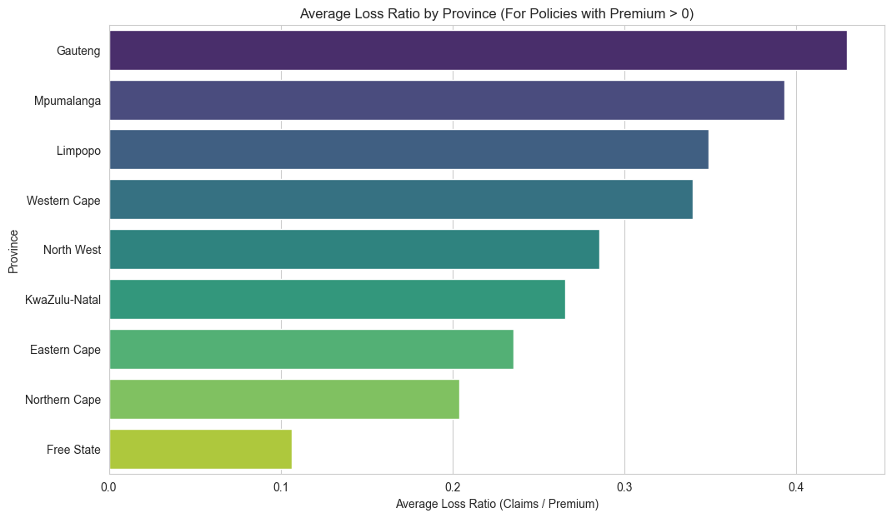
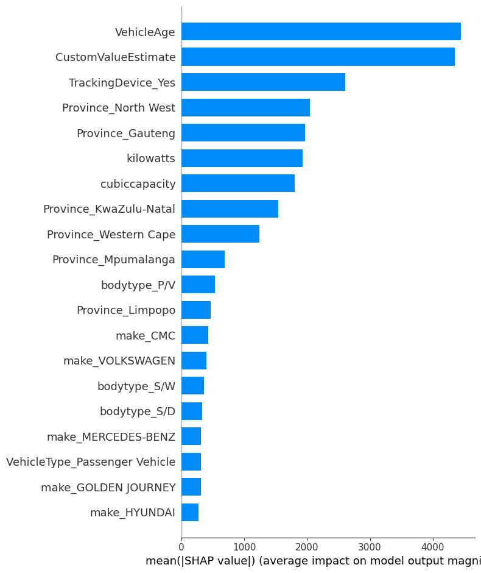

# acis-insurance-risk-analytics-Modeling# End-to-End Insurance Risk Analytics for AlphaCare

**Project by: Miheret Girmachew**

## 1. Executive Summary

In a competitive insurance market, understanding and accurately pricing risk is paramount. This project was initiated to analyze AlphaCare Insurance Solutions' (ACIS) historical car insurance data from 2014-2015 to identify key risk drivers, discover profitable market segments, and build a foundation for a data-driven pricing strategy.

Through a comprehensive analysis of over 600,000 policy records, we uncovered that **geographic location is the single most significant driver of risk.** Policies in **Gauteng**, for example, are demonstrably riskier, with a Loss Ratio (claims paid out vs. premiums earned) of **43%**, while policies in the **Free State** are exceptionally profitable, with a Loss Ratio of only **11%**. These findings were validated with rigorous statistical testing (p < 0.001), confirming they are not due to random chance.

While precisely predicting the monetary value of a claim proved challenging with the available data (R-squared of -0.04), our machine learning models were highly effective at identifying the *factors* that influence claim costs. **Vehicle Age**, **Custom Value Estimate**, and the presence of a **Tracking Device** emerged as the most critical predictors.

Based on these robust findings, this report recommends a strategic pivot towards:
1.  **Implementing a region-based pricing model.**
2.  **Launching targeted growth campaigns in low-risk provinces.**
3.  **Incentivizing risk-reducing features like tracking devices.**

## 2. Project Overview & Objectives

This project was undertaken to support ACIS's goal of developing cutting-edge risk and predictive analytics. The primary objectives were:
*   Analyze historical insurance claim data to identify patterns and key risk drivers.
*   Optimize marketing strategy by discovering "low-risk" client segments.
*   Develop a foundation for a dynamic, risk-based premium pricing model.
*   Provide concrete, data-backed recommendations to enhance ACIS's insurance products and strategy.

## 3. Methodology: A Four-Phase Analytical Approach

Our analysis followed a structured, end-to-end data science workflow:

1.  **Data Preparation & Cleaning:** The raw data, a 500MB pipe-separated text file, was loaded and rigorously cleaned. This involved correcting data types, handling over 1 million missing values through strategic imputation and removal, and engineering key metrics like Loss Ratio. The cleaned dataset consists of 999,224 policy records and 47 relevant features.
2.  **Exploratory Data Analysis (EDA):** We used descriptive statistics and visualizations to uncover initial patterns, focusing on the Loss Ratio as a primary KPI.
3.  **Hypothesis Testing:** We employed formal statistical tests (ANOVA and Chi-Squared) to scientifically validate the insights discovered during EDA.
4.  **Predictive Modeling & Interpretation:** We developed several machine learning models (Linear Regression, Random Forest, XGBoost) to predict claim severity. While predictive accuracy was low, we used SHAP (SHapley Additive exPlanations) to interpret the model's logic and identify the most influential risk factors.

## 4. Uncovering Key Insights from the Data (EDA)

Our initial exploration focused on the Loss Ratio, a critical measure of profitability. After filtering out policies with zero or negative premiums, which likely represent cancellations or data errors, we uncovered a stark reality about geographic risk.

**Key Finding 1: Risk is Not Uniform Across South Africa.**

*This chart clearly shows that some provinces are significantly more profitable than others.*

*   **High-Risk Zone:** **Gauteng** stands out with a Loss Ratio of **43%**, making it the least profitable province for ACIS. For every R100 collected, R43 is paid out in claims.
*   **Profitable Opportunity:** The **Free State** is a highly profitable region with a remarkably low Loss Ratio of just **11%**.
*   **Conclusion:** This immediately proves that a one-size-fits-all pricing strategy is suboptimal. It leaves ACIS vulnerable to losses in high-risk areas while potentially overcharging clients in low-risk ones, making them uncompetitive.

## 5. Validating Our Assumptions with Statistical Testing

To ensure our observations were not due to random chance, we conducted formal hypothesis tests. The results were conclusive and provide a scientific foundation for our recommendations.

*   **Hypothesis:** There are no risk differences across provinces.
    *   **Test for Claim Severity (ANOVA):** p-value ≈ 1.09e-05
    *   **Test for Claim Frequency (Chi-Squared):** p-value ≈ 8.43e-18
    *   **Conclusion:** With p-values significantly less than 0.05, we **strongly reject the null hypothesis**. There are statistically significant differences in both how often claims occur and how much they cost across provinces.

*   **Hypothesis:** There are no risk differences between the top 10 zip codes.
    *   **Test for Claim Severity (ANOVA):** p-value ≈ 4.16e-08
    *   **Conclusion:** We **reject the null hypothesis**. Even within provinces, risk is not uniform and varies significantly at a more granular zip code level.

## 6. Building a Predictive Model to Understand Risk Drivers

The final analytical step was to build models to predict the amount of a potential claim (`TotalClaims`).

**Model Performance:**
The models' performance in predicting the exact claim amount was low, with the best model (Linear Regression) achieving an R-squared of -0.04. This is not unexpected; claim amounts have a high degree of inherent randomness. A negative R-squared indicates that the model performed worse than simply predicting the average claim amount for all cases.

| Model               | Root Mean Squared Error (RMSE) | R-squared |
| ------------------- | ------------------------------ | --------- |
| Linear Regression   | 38789.01                       | -0.04     |
| Random Forest       | 41413.85                       | -0.18     |
| XGBoost             | 42421.38                       | -0.24     |

**The Real Value: Model Interpretation with SHAP**
While the models cannot reliably predict a specific claim value, their true power lies in revealing *why* they make their decisions. By analyzing our XGBoost model with SHAP, we identified the most influential features that drive claim costs.

*This chart ranks the features by their overall impact on the model's predictions for claim amount.*

**Top 3 Drivers of Claim Cost:**
1.  **Vehicle Age:** The older a vehicle is, the higher the expected claim cost. This is consistently the most dominant factor in our model.
2.  **Custom Value Estimate:** More valuable cars lead to higher claim costs, which aligns with business logic.
3.  **Tracking Device:** Crucially, the presence of a tracking device **significantly lowers** the expected claim cost. This is a powerful, quantifiable insight, likely due to increased vehicle recovery rates after theft.

## 7. Concrete, Data-Backed Recommendations

Based on this comprehensive analysis, we propose the following strategic actions for ACIS:

1.  **Implement Region-Based Premium Adjustments:** The current pricing model is flawed. It must be enhanced with a "province risk factor." Premiums in Gauteng should be systematically higher than those in the Free State for an otherwise identical client and vehicle, reflecting the statistically proven difference in risk.

2.  **Launch a Targeted Growth Campaign in Low-Risk Provinces:** ACIS should aggressively market its products in the **Free State** and **Northern Cape**. By offering more competitive, lower premiums in these demonstrably low-risk areas, ACIS can attract new, profitable customers and grow its market share away from the high-risk Gauteng region.

3.  **Incentivize Risk-Reducing Features:** The data clearly shows that tracking devices reduce claim costs. ACIS should introduce a **significant premium discount** (e.g., 5-10%) for clients who have a verified tracking device installed. This encourages safer behavior, reduces the company's overall risk exposure, and creates a compelling marketing message.

## 8. Conclusion and Next Steps

This project has successfully transformed raw historical data into a clear strategic roadmap. We have moved from anecdotal evidence to data-backed conclusions, validating our insights with statistical rigor and using machine learning to uncover the hidden drivers of risk.

While our analysis was robust, the low predictive power of our claim severity model highlights a key limitation. To achieve more precise, dynamic pricing, more data is needed. Future work should focus on:
*   **Acquiring Telematics Data:** Incorporating driver behavior data (mileage, braking habits, time of day) would dramatically improve model accuracy.
*   **Refining Feature Engineering:** Exploring more complex interactions between features (e.g., age of vehicle in a specific zip code).

By implementing the recommendations from this report, AlphaCare can better segment its market, price its products more accurately, and create a sustainable competitive advantage in the South African insurance landscape.